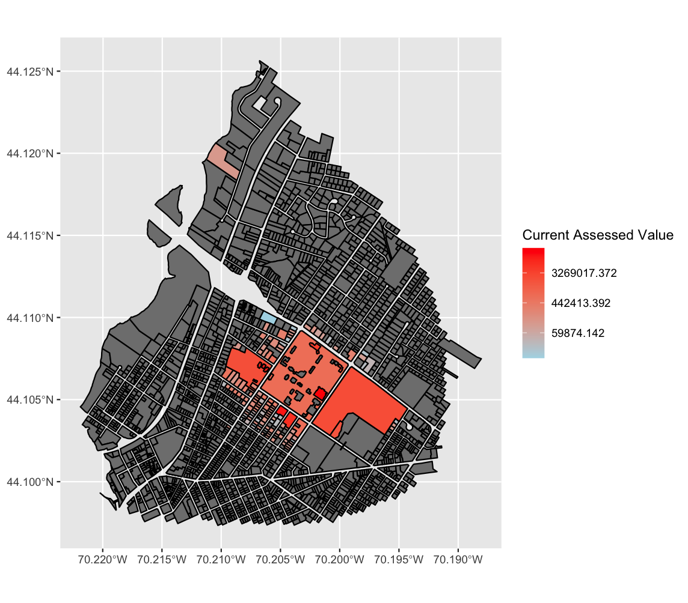

This R project analyzes Bates College property ownership and value changes using GIS data and property assessment records. It demonstrates data cleaning, visualization, spatial analysis, and statistical testing.

Highlights
- Maps Bates-owned parcels with color-coded assessed values.
- Performs Wilcoxon test comparing purchase prices to current values.
- Visualizes property purchasing history and value changes over time.
- Uses shapefiles, CSV datasets, and R packages (sf, ggplot2, tidyverse).

Data Utilized
- data/LewistonParcelsBates-area.shp
- data/FinalDataset.csv

Usage
- Place the data files in a data folder relative to the script.
- Install required packages:"sf", "ggplot2", "tidyverse"
- Run the script to generate maps and visualizations.

Attached in the folder is a report displaying the plots and an analysis of the significance of the data and plots
