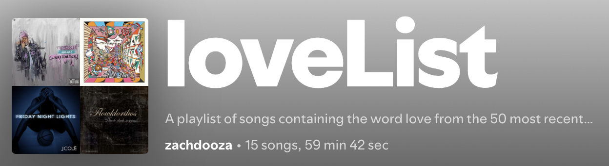

This Python project generates custom Spotify playlists based on user-specified criteria, including song popularity, artist age, release year, or lyrics content. It demonstrates API usage, web scraping, GUI design, and object-oriented programming.

Watch the demo on YouTube: [https://www.youtube.com/watch?v=Y4sLK3HNj_k](https://www.youtube.com/watch?v=Y4sLK3HNj_k)

Highlights
- Creates playlists from liked songs using Spotify API (Spotipy).
- Filters songs by popularity, artist age, release year, or presence of a specific word in lyrics, then creates new playlist of the desired criteria in your library
- Scrapes artist information from Wikipedia and lyrics from AZLyrics when necessary.
- Provides an interface using PySimpleGUI for intuitive user input and playlist generation.

Data Utilized
- User’s saved tracks from Spotify library (via Spotify API).
- Artist information from Wikipedia pages.
- Lyrics data from AZLyrics website.

How it was Made
- Spotify API Integration: spotipy library handles authentication via OAuth and client credentials. The script fetches the user’s liked songs and creates new playlists.
- Playlist Filtering: Functions playlistByPopularity, playlistByAge, playlistByYear, and playlistByWord allow selection based on popularity, artist age, release year, or word presence in lyrics.
- Web Scraping: BeautifulSoup and requests are used to scrape Wikipedia for artist ages and AZLyrics for song lyrics when filtering is needed. Regular expressions parse ages and format song/artist names for URLs.
- GUI Design: PySimpleGUI provides an interface with buttons for each playlist type. Input validation ensures correct number ranges, integer inputs, and playlist constraints. Popups provide user feedback on playlist creation or errors.
- Object-Oriented & Procedural Code: Modular functions manage playlist logic and API requests, making the code reusable and maintainable.

Usage
- Install Python and required libraries: spotipy, requests, beautifulsoup4, PySimpleGUI.
- Set up a Spotify Developer app and provide the client ID, client secret, and redirect URI for authentication.
- Run the script and use the GUI to select playlist type, input filters, and generate playlists.
- The script automatically creates public playlists in the user’s Spotify account based on the selected criteria.
